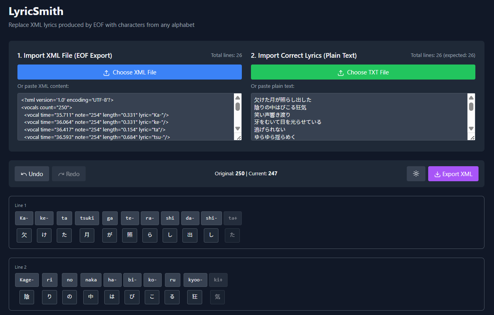

# LyricSmith

A web-based tool for replacing romanized lyrics with native scripts in Rocksmith 2014 XML files.



## The Problem

Editor On Fire (EOF) doesn't support characters outside the Latin alphabet. When creating custom songs with lyrics in Cyrillic, Japanese, Chinese, or extended Latin scripts (Hungarian, Polish, etc.), charters have to:
1. Sync lyrics using only latin text in EOF
2. Manually edit the exported XML file to replace each syllable
3. Spend up to an hour on a repetitive process for a single song

**LyricSmith helps in this process this by providing a syllable matching interface that reduces this process to just a few minutes (or even a few seconds).**

## Features

- **Multi-alphabet support**: Works with Cyrillic, CJK (Chinese/Japanese/Korean), Arabic, and extended Latin scripts
- **Automatic parsing**: Intelligently splits matching syllables if they are also in latin script (useful for songs with mixed scripts) with support for languages like Hungarian, Polish, Norwegian, Portuguese, etc that contain modified versions of the latin script.
- **Visual matching**: Click syllables to merge them until they align with your target text
- **Real-time validation**: Line count verification and syllable counter
- **Undo/Redo**: Full history support for all edits
- **100% client-side**: No data leaves your browser
- **Zero installation**: Web-based tool, works anywhere
- **Visual guides**: See the green/red ribbon on the left of each lyric line to check whether the syllable counts match between both rows, hover this ribbon with your mouse for more data.
- **Line reset**: Click the X on the top right of each lyric line to undo all changes to the line.

## How It Works

1. **Import your files**
   - Upload the XML file exported from EOF (contains timing data with romanized lyrics)
   - Upload or paste plain text with the correct lyrics in the target alphabet

2. **Automatic processing**
   - LyricSmith parses the XML structure and extracts timing information
   - Detects the alphabet of your target lyrics
   - Splits both texts into matchable units (syllables for Latin, characters for others)
   - Groups them into lines based on EOF's line markers

3. **Manual alignment**
   - Click syllables to merge adjacent ones until they match your target text
   - Both rows are clickable: adjust either the XML syllables or plain text characters
   - The syllable counter shows your progress

4. **Export**
   - Download the modified XML with timing data preserved
   - Import into DLCBuilder

## Getting Started

If you are a Rocksmith charter and don't wanna deal with code, just go to:
```
https://alanelplatano.github.io/LyricSmith/
```

### Local Development

If you wanna check the code you can follow these steps:

```bash
# Clone the repository
git clone https://github.com/AlanElPlatano/LyricSmith
cd lyricsmith

# Install dependencies
npm install

# Run development server
npm run dev

# Build for production
npm run build
```

## Technical Details

- **Framework**: React 19 with TypeScript
- **Build Tool**: Vite
- **Styling**: Tailwind CSS
- **Testing**: Vitest with React Testing Library
- **XML Parsing**: fast-xml-parser

## Usage Tips

- **Line count mismatch**: Ensure your plain text has the same number of lines as the XML (marked with `+` in EOF)
- **Syllable merging**: Click a syllable to merge it with the next one. Keep clicking until it matches your target text
- **Undo mistakes**: Use the undo/redo buttons or keyboard shortcuts (Ctrl+Z / Ctrl+Y)
- **Latin scripts**: LyricSmith attempts automatic matching for similar syllables
- **Non-Latin scripts**: Characters are split individually for maximum flexibility

## Contributing

Contributions are welcome! Please feel free to submit a Pull Request.

## License

This project is open source and available for the Rocksmith 2014 custom song community. Big shoutout to the CustomsForge and its team.

**Disclaimer**: This software is NOT associated with Ubisoft or the Rocksmith team in any way or form.